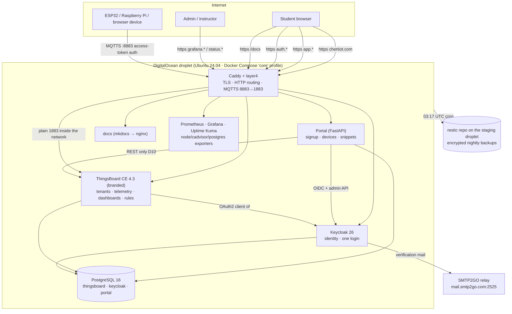
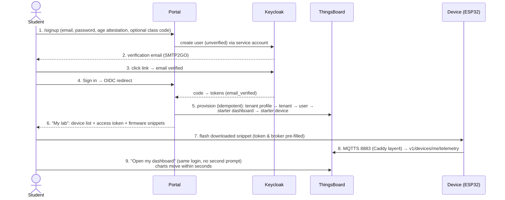

# CHERT IoT — Architecture, Open-Source Engines & User Journeys

**Version:** v1.0.0 (launched 2026-09-01) · **Live:** <https://chertiot.com> · **Repo:** <https://github.com/chertsa/chertiot>

CHERT IoT is a self-contained, multi-tenant IoT laboratory for students. The build philosophy (PLAN.md D1–D12): assemble proven open-source engines, write custom code only where no engine exists (the portal), integrate exclusively through public APIs, and keep every environment reproducible from this one repository.

---

## 1. System architecture



Two identical environments run this stack: **production** `chertiotserver2` (134.122.31.32, 4 vCPU/8 GB) and **staging** `chertiotstagingserver2` (161.35.119.46, 2 vCPU/4 GB, `stage.*` subdomains). Nothing reaches production untested on staging (D9).

### Routing map (Caddyfile.prod, one file for both environments via `{$DOMAIN}`)

| Host | Backend | Purpose |
|---|---|---|
| `chertiot.com` | portal:8000 | signup, device pages, `/docs` (→ docs:80) |
| `app.chertiot.com` | tb:8080 | ThingsBoard UI + REST + HTTP telemetry |
| `auth.chertiot.com` | keycloak:8080 | login pages, OIDC endpoints |
| `status.chertiot.com` | uptime-kuma:3001 | public status page |
| `grafana.chertiot.com` | grafana:3000 | admin metrics |
| `:8883` (layer4 TLS) | tb:1883 | device MQTT — TLS terminates in Caddy, TB sees plain MQTT |

---

## 2. Open-source engines — function, license, where in the repo

**Core platforms** (the product is these engines, integrated):

| Engine | License | Function in CHERT IoT | Where configured |
|---|---|---|---|
| **ThingsBoard CE 4.3.1.4** | Apache-2.0 | The IoT core: device connectivity (MQTT/HTTP), multi-tenancy, telemetry storage, dashboards, rule chains, alarms, REST API. One **tenant per student** (D4); quotas via tenant profiles. Runs as `tb-node` monolith, external Postgres, in-memory queue. Rebranded **from source** via a 4-patch series (logos, titles, palette, login attribution, email templates) — Apache attribution kept ("powered by ThingsBoard"). | `deploy/tb/tb-node.env`, `thingsboard-brand/` (patches, build.sh, smoke.sh), image `ghcr.io/chertsa/chertiot-tb` |
| **Keycloak 26.7.2** | Apache-2.0 | Identity (D3): realm `chertiot`, one login for portal + ThingsBoard (+ Grafana/JupyterHub later). TB is an OAuth2 *client* of Keycloak; its login mapper auto-creates the student's tenant (`tenantNameStrategy=EMAIL` → TENANT_ADMIN). Sends verification mail. CHERT login theme (tokens, Arabic locale). | `portal/scripts/setup_keycloak.py` (source of truth), `keycloak/theme/`, `keycloak/realm/` (export artifact) |
| **PostgreSQL 16.15** | PostgreSQL | Single instance, three databases: `thingsboard` (incl. telemetry timeseries), `keycloak`, `portal`. | compose `postgres` service, `deploy/postgres/init.sql` |
| **Caddy 2.11.4 + caddy-l4** | Apache-2.0 | Edge: automatic Let's Encrypt TLS for every vhost, HTTP reverse proxy, and **layer4 TLS termination for MQTTS 8883 → tb:1883** (D8) — devices need no certificates, only their access token. One image everywhere: `ghcr.io/chertsa/chertiot-caddy`. | `deploy/caddy/` (Dockerfile, Caddyfile.dev/.prod) |

**Operations engines:**

| Engine | License | Function | Where |
|---|---|---|---|
| **Prometheus v3.14** | Apache-2.0 | Scrapes TB, Keycloak, Caddy, portal, node/cadvisor/postgres exporters; 7 alert rules (service down, disk, RAM, cert expiry, backup age, PG connections, TB queue). | `monitoring/prometheus/` |
| **Grafana 13.1** | AGPL-3.0 | Admin-only dashboards over Prometheus (unmodified, self-hosted — AGPL obligations satisfied by publishing this repo). | compose `grafana`, `monitoring/grafana/` |
| **Uptime Kuma 2.5** | MIT | Public status page + up/down alerting, fully self-hosted. | compose `uptime-kuma` |
| **node-exporter · cAdvisor · postgres-exporter** | Apache-2.0 | Host, per-container and database metrics — the data behind capacity planning and the flood test. | compose services |
| **restic 0.16** | BSD-2 | Encrypted nightly backups (03:17 UTC): `pg_dump` of all three DBs + `.env` + Caddy/Grafana/Kuma volumes → SFTP repo on the *other* droplet; password escrowed off-box. Restore drill proven: **260 s**. | `deploy/scripts/backup.sh`, `restore-drill.sh`, `deploy/runbooks/` |
| **Mailpit** (dev only) | MIT | Local mail catcher so e2e tests can click real verification links. Production uses the SMTP2GO relay. | `docker-compose.override.yml` |
| **mkdocs-material** | MIT | Student docs (getting started ×4 tracks, MQTT guide, limits, privacy, fair use) built to static nginx at `/docs`. | `docs-site/` |

**Portal building blocks** (the one custom component, kept thin — D10):

| Library | Function |
|---|---|
| **FastAPI + Uvicorn** | The portal web app: server-rendered Jinja2 pages, no JS build chain |
| **SQLAlchemy 2 + Alembic** | Portal DB: `portal_users` (Keycloak↔TB mapping, cohort, provisioning state), `class_codes`, `audit_log`; migrations run on container start |
| **Authlib** | OIDC login against Keycloak (authorization-code flow) |
| **httpx + tenacity + pydantic** | `tb_client.py` — the **only** ThingsBoard touchpoint: typed REST wrapper with JWT refresh and retry |
| **paho-mqtt** (tests) | Real MQTT publishes in integration/e2e/flood tests |

---

## 3. Repository structure

```
chertiot/
├── PLAN.md · CLAUDE.md · BACKLOG.md      # build plan (D1–D12), living status, deferred scope
├── docker-compose.yml                    # the whole platform; profiles core|flows|lab|lora
├── docker-compose.override.yml           # dev-only: loopback ports, Mailpit
├── Makefile                              # dev/test/e2e/lint/bootstrap/deploy targets
├── portal/                               # ★ custom FastAPI portal
│   ├── app/
│   │   ├── main.py · config.py · db.py · models.py · audit.py
│   │   ├── tb_client.py                  # ThingsBoard REST wrapper (D10: REST only, ever)
│   │   ├── provisioning.py               # idempotent tenant/dashboard/device provisioning
│   │   ├── keycloak_admin.py             # service-account user management (no passwords held)
│   │   ├── onboarding.py · student.py · snippets.py · ratelimit.py · auth.py
│   │   ├── routers/  (home, signup, auth, devices)
│   │   ├── templates/ + static/          # Jinja2 + CHERT design tokens (§9/§10 verbatim)
│   ├── scripts/                          # setup_keycloak, setup_tb_oauth2, rotate_tb_sysadmin,
│   │                                     # provision_student, class_code, staging_smoke, exports
│   ├── migrations/                       # Alembic
│   └── tests/ (unit · integration · e2e) # 24 tests + 3 e2e incl. running real firmware
├── thingsboard-brand/                    # source-built rebrand: patches/ assets/ build.sh smoke.sh
├── templates-tb/                         # tenant profile (quotas, D4) + starter dashboard JSON (D5)
├── keycloak/                             # realm export artifact + CHERT login theme
├── firmware-examples/                    # esp32-arduino · esp32-micropython · rpi-python · browser-js
├── docs-site/                            # student documentation (mkdocs-material)
├── deploy/                               # bootstrap.sh (hardening) · deploy.sh · backup/restore ·
│   ├── caddy/ · tb/ · postgres/ · runbooks/
├── monitoring/                           # prometheus.yml + alert rules + grafana provisioning
├── tests-platform/                       # tenancy isolation + flood/rate-limit tests
└── .github/workflows/                    # ci (lint+unit, full-stack e2e+isolation) · nightly flood ·
                                          # images (branded TB + Caddy → GHCR)
```

---

## 4. Identity & tenancy model

- **Keycloak** owns every human credential. The portal stores **no passwords** — it is an OIDC client; ThingsBoard is another OIDC client of the same realm. One login works everywhere (D3).
- **ThingsBoard's OAuth2 mapper** (`tenantNameStrategy=EMAIL`, `allowUserCreation`) creates, on first login, a **tenant named after the student's email** with the student as `TENANT_ADMIN` — full rights over their own devices, dashboards, rule chains, alarms (D4). CE "customers" are never used (read-only, rejected by design).
- **Quotas** live in the default **tenant profile** `chertiot-student` (templates-tb): 10 devices, 10 msg/s + 300 msg/min per device, 50 msg/s per tenant, 90-day telemetry TTL, capped REST/WebSocket rates. A flooding device is throttled and disconnected; CI proves neighbours stay unaffected.
- **Isolation is inherited, never re-implemented** (D10): every read/write path in the portal impersonates the student's own TB user; `tests-platform/test_isolation.py` proves cross-tenant REST reads/writes fail and one device's token cannot write into another tenant.
- **Devices** authenticate with per-device access tokens (MQTT username) — revocable per device from the portal.

---

## 5. User journeys

### 5.1 Student — from nothing to live data (~10 minutes, verified by Gate 2 walkthrough)



Detail by step:

1. **Signup** (`/signup`): email + password + required age attestation (D11) + optional instructor class code (routes the account into a cohort; invalid/expired codes are rejected). Rate-limited 5/hour/IP.
2. **Verification**: Keycloak sends the mail; the link shows Keycloak's confirm page and lands back on the portal ("Email verified — sign in").
3. **First login**: portal OIDC callback adopts the user, then **provisions idempotently** — the same routine repairs drift on every later login (deleted device? recreated).
4. **My lab / My devices**: list with online state and last-seen; add up to 10 devices; each device page shows connection details, the access token, and **ready-to-run starter code for 4 tracks** (ESP32 Arduino, ESP32 MicroPython, Raspberry Pi Python, browser-only HTTP) with the token, broker and device name already injected.
5. **Device data path**: MQTTS `chertiot.com:8883`, username = access token, topic `v1/devices/me/telemetry`, JSON payload. TLS ends at Caddy; TB enforces per-device/tenant rate limits.
6. **Dashboard**: the student owns a real ThingsBoard tenant — the starter "My devices" dashboard (auto-resolves every device) is theirs to edit; **Reset starter dashboard** re-imports the pristine template (D5) without touching devices or data.
7. **Housekeeping**: rename device, **Issue new token** (old one dies instantly — for leaked tokens), delete device, quota display, docs at `/docs`.

### 5.2 Instructor (current v1.0 surface; full console is Phase 3 / M3.3)

1. Requests a class code — created today via CLI (`make class-code CODE=CS101 COHORT=cs101-fall26 INSTRUCTOR=prof@uni.edu`), with expiry and max uses.
2. Students sign up with the code → tagged into the cohort; the code counts uses and expires.
3. Phase 3 adds: self-service code management, roster (last-seen, device counts, message volume — never private data), reset/suspend, login-as for support (D6).

### 5.3 Operator / admin

| Task | How |
|---|---|
| Deploy or upgrade an environment | `make staging-deploy` / `make prod-deploy` → `deploy/scripts/deploy.sh` (git pull on server → compose pull/build → health gate → idempotent Keycloak/TB bootstrap → smoke). Staging always first (D9) |
| New server from zero | `deploy/scripts/bootstrap.sh` — hardening, UFW (22/80/443/8883), fail2ban, swap, Docker |
| Watch the platform | Grafana (metrics), Prometheus alerts (email), Uptime Kuma public status |
| Backups | nightly cron; restore with `deploy/scripts/restore-drill.sh` — drill on record: 260 s |
| Back-office | Keycloak admin (`auth.…/admin`), TB sysadmin (all tenants), per `deploy/secrets.production-admin.env` |
| Upgrade ThingsBoard | bump tag → `thingsboard-brand/build.sh` re-applies the patch series (`git apply --check` gates) → CI builds → staged rollout — a deliberate milestone, never a side effect |

### 5.4 The device's journey (what the firmware sees)

Connect `chertiot.com:8883` with TLS (public CA — no cert provisioning) → authenticate with the access token as MQTT username → publish JSON to `v1/devices/me/telemetry` → TB timestamps, rate-checks against the tenant profile, stores into Postgres timeseries → dashboards and the REST API serve it back, scoped to the owning tenant only. Over-limit messages are dropped; a persistent flooder is disconnected (proven in `tests-platform/test_flood.py`).

---

## 6. Quality gates that guard all of this

| Gate | Proof |
|---|---|
| Every push | CI: lint + 24 unit/integration tests + **full compose stack** e2e (signup→mail→SSO→device→telemetry) + tenancy isolation, on clean runners |
| Nightly | flood test (1000 msg/s attacker vs control tenant) |
| Images | branded TB & Caddy built and smoke-tested in CI, published to GHCR — never on a workstation |
| Releases | `v0.9.0` = Gate 1 (local platform proven) · `v1.0.0` = Gate 2 (production live, human walkthrough, backups + 260 s restore drill) |

## 7. What comes next (deferred by design — D12)

Phase 3: Node-RED per-student containers, JupyterHub with a telemetry helper, instructor/admin console, alerts & CSV export. Phase 4: LoRaWAN via ChirpStack. Backlog highlights: Arabic language toggle across portal/docs/emails (owner-requested), TB upgrade drill on the next upstream tag, CSRF tokens, session-cached TB JWTs. See `BACKLOG.md`.
