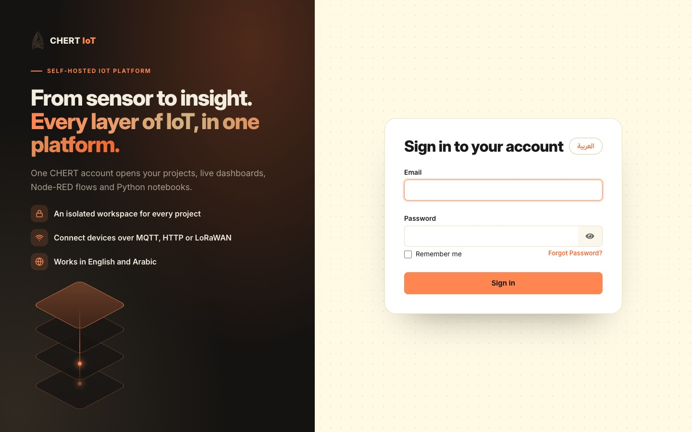
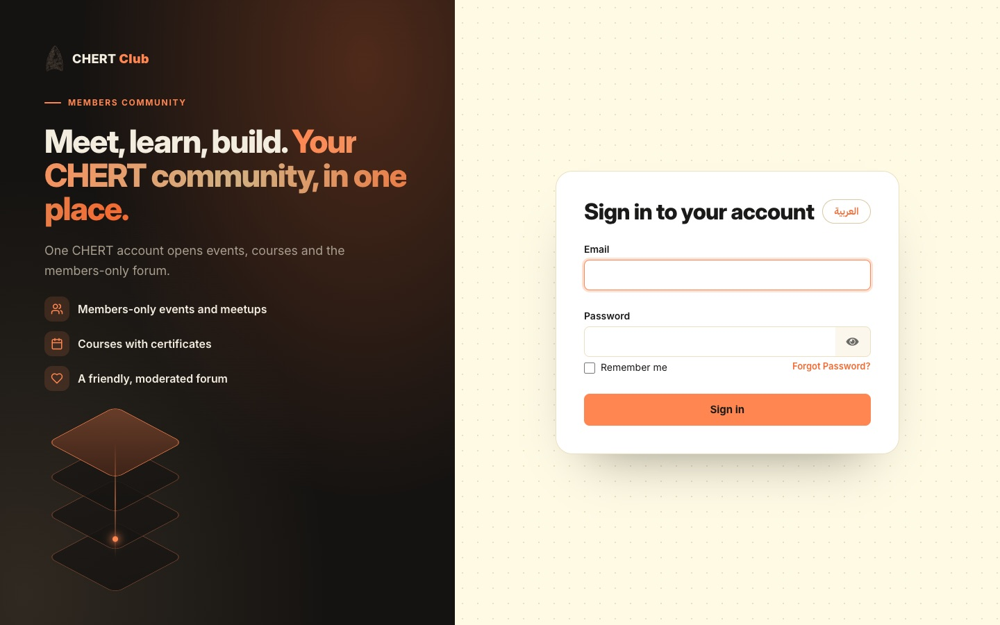
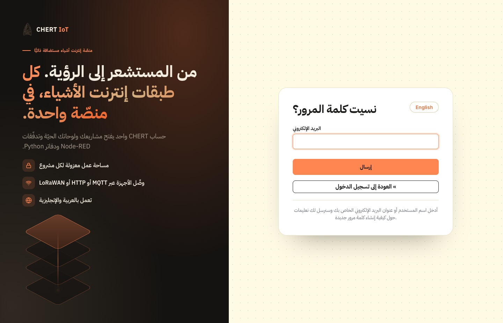
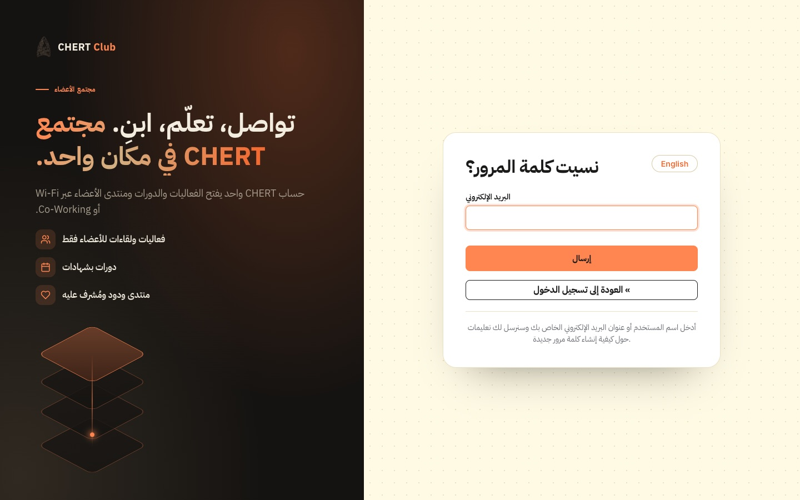

# CHERT Keycloak sign-in design: universal rebranding kit

One sign-in experience for every CHERT project that uses Keycloak. It reproduces
**https://auth.chertiot.com** (CHERT IoT) exactly: the dark animated brand panel, the CHERT form
card, English/Arabic with a language pill, the CHERT favicon and fonts. **Only the text changes**
per project.

| Reference (chertiot.com) | Another project built from this kit (CHERT Club) |
|---|---|
|  |  |
|  |  |

## Use it

- **With Claude Code** (recommended): open the target project and paste [`PROMPT.md`](PROMPT.md).
- **By hand:** follow [`GUIDE.md`](GUIDE.md) §5. In short:
  1. Copy `theme/chert` into your project.
  2. Write `project.json` (from [`project.example.json`](project.example.json)) and run
     `python3 tools/apply_project.py project.json <your-theme>/login`.
  3. Mount the theme into Keycloak, run `tools/keycloak_setup.py`, add the `ui_locales` handoff
     to your app ([`integration/APP-INTEGRATION.md`](integration/APP-INTEGRATION.md)), restart
     Keycloak, then check with `tools/verify_login.js`.

## Contents

| Path | What |
|---|---|
| [`GUIDE.md`](GUIDE.md) | Master guide: design spec (tokens, layout, type, components, motion), behaviour rules, install, verification, pitfalls |
| [`PROMPT.md`](PROMPT.md) | Copy-paste prompt for Claude Code in each project |
| [`project.example.json`](project.example.json) | The only per-project input (chertiot.com's text as the example) |
| [`theme/chert/`](theme/chert/) | The Keycloak login theme: template, CSS, fonts, logo, favicon, EN/AR messages |
| [`tools/`](tools/) | `apply_project.py`, `version_assets.py`, `keycloak_setup.py`, `test_keycloak_theme.py` (CI), `verify_login.js` (browser) |
| [`integration/`](integration/) | App language handoff (FastAPI, Flask, Django, Node, Next.js, keycloak-js, Spring) and Keycloak setup |
| [`upstream/`](upstream/) | Keycloak 26.7.2 original template and the CHERT diff, for other Keycloak versions |
| [`screenshots/`](screenshots/) | Reference renders: EN/AR, desktop/phone, sign-in and forgot password |

**Verified:**
- production chertiot.com passes all 38 checks of `tools/verify_login.js`;
- a clean Keycloak 26.7.2 running the CHERT Club example from this kit passes 36 of 36.

Pinned to Keycloak 26.7.2; kit version `keycloak-kit-1.0.0`.
